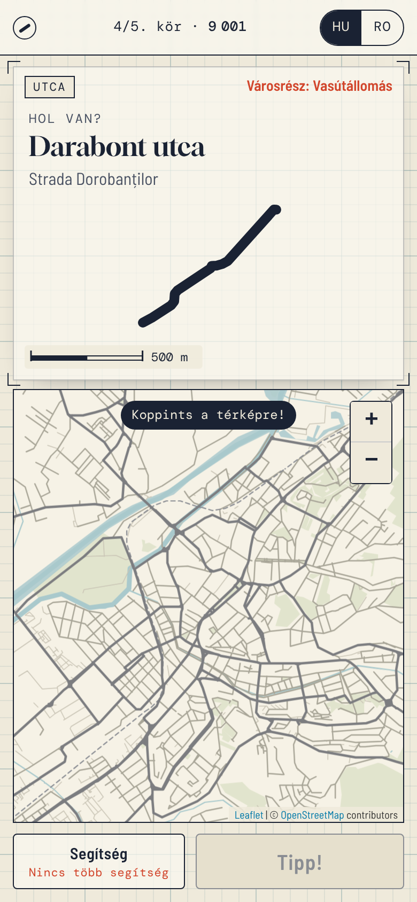
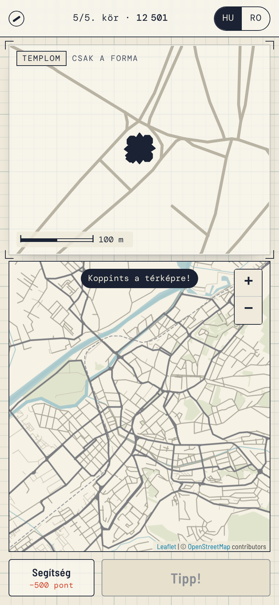

# melyikutca
Melyik utca? – Marosvásárhelyi utcakvíz egy felirat nélküli térképen. Háromféle kör: a kiemelt utca, tér vagy épület nevét kell kiválasztanod négy közül („Melyik ez?”), a megadott nevet kell megtalálnod a térképen („Hol van?”), vagy csak az alakja alapján kell rábökni („Csak a forma”). Öt kör, napi kihívás, magyar és román felület. Mobilra készült, az adatok az OpenStreetMapből származnak.

## How the game works

A round is one of three kinds, from easiest to hardest:

| Kind | You see | You do | Points |
|---|---|---|---|
| **Melyik ez?** (multiple choice) | the place highlighted on the label-free map | pick its name from four | 5000 / 2500 / 1000 for the 1st / 2nd / 3rd pick |
| **Hol van?** (name to map) | its name, in Hungarian and Romanian | tap where it is | by distance (below) |
| **Csak a forma** (shape) | its outline only, with the surrounding streets for buildings | tap where it is | by distance |

| Mode | Rounds |
|---|---|
| Könnyű | 3× multiple choice (wrong options far away) and 2× name to map. Only the best-known places: the 40 best-known streets, the squares and the landmarks |
| Közepes | 2× multiple choice (wrong options are the neighbouring streets), 2× name to map, 1× shape of a well-known place |
| Nehéz | lesser-known streets: 2× name to map, 1× multiple choice among neighbours, 1× shape of a well-known place, 1× „which street are these blocks along?” |
| Napi kihívás | easy to hard: multiple choice, name to map, multiple choice, name to map, shape |

Hints: the neighbourhood (−500), then the shape (name rounds) or the first letter (shape rounds) (−1000). In multiple choice, halving removes two wrong answers (−1500).

<p>






</p>

## Running it

It's a static site, so no build step is needed to play:

```sh
python3 -m http.server 8000   # then open http://localhost:8000
```

It works the same on GitHub Pages. Serve it from the repository root.

## Files

| | |
|---|---|
| `index.html`, `style.css`, `game.js` | the game (no framework, no CDN) |
| `config.js` | optional CARTO API key (see below) |
| `data/puzzles.json` | puzzles, generated by `build_puzzles.py` |
| `data/basemap.json` | label-free background map, generated by `build_puzzles.py` |
| `vendor/leaflet/` | Leaflet 1.9.4 (BSD-2-Clause) |
| `vendor/fonts/` | Gloock, Barlow Semi Condensed and DM Mono (SIL OFL 1.1) |

## Rebuilding the data

```sh
python3 build_puzzles.py            # uses .cache/ when present
python3 build_puzzles.py --refresh  # downloads everything again
```

The script uses only the standard library. It queries Overpass (overpass-api.de, then overpass.kumi.systems, then overpass.private.coffee, with retries) for the bounding box 46.49,24.47 – 46.60,24.66. It keeps only puzzles that lie inside the Târgu Mureș municipal boundary. It then writes both data files and prints a summary.

- **Streets** (`street`): named highways from primary to residential, plus pedestrian streets, at least 120 m long. Ways that share a name are merged when they touch. Only streets with a recognisable outline (`shape: true`) are used in shape rounds. A street is excluded from them if it is shorter than 150 m, or if it is nearly straight: every vertex lies within max(25 m, 6 % of its length) of the main axis.
- **Squares** (`square`): `place=square`, named pedestrian areas, and highways named „Piața …” / „… tér”.
- **Landmarks** (`landmark`): only buildings most locals could place. That means the famous ones (Cultural Palace, Prefecture, City Hall, the cathedrals, Vártemplom, the theatre, Teleki Library, the Great Synagogue, the stadium, Hotel Continental and others) and big Catholic, Orthodox, Reformed, Unitarian and Lutheran churches within 1.3 km of the centre. The citadel walls are assembled from the unnamed `barrier=city_wall` ways. Each landmark has a category (church, palace, hotel, …) that the round label shows.
- **Block clusters** (`blocks`): `building=apartments` within 80 m of each other, at least 4 blocks per cluster. Big estates are split into clusters of at most 18 blocks. Each cluster is labelled by the nearest named street.

Landmarks and block clusters also store the streets around them (`ctx`). Shape rounds draw these faintly behind a building: a footprint on its own is close to impossible to place, but a footprint next to a recognisable junction is fair.

Difficulty is about how well known a place is, not how it looks. Each street gets a `known` score (0–100) from:

| Signal | Weight |
|---|---|
| road class | 25 % |
| closeness to Rózsák tere | 28 % |
| businesses with this street in their address (`addr:street` on shops, offices, amenities) | 18 % |
| length | 12 % |
| bus or trolleybus route along it | 10 % |
| all addresses on it | 7 % |

The 40 best-known streets are *easy*, the next 120 *medium*, and the rest *hard*. Squares and landmarks are all *easy*, and block clusters are *hard*.

## Map tiles: CARTO now needs a key

Since 25 September 2026, CARTO serves its raster basemaps (`light_nolabels` included) only with an API key. Without one, every tile shows "API KEY REQUIRED". A key is free for non-commercial use, and you don't need an account: <https://carto.com/basemaps/apikey>. Put it in `config.js`:

```js
window.MELYIKUTCA_CONFIG = { cartoKey: 'your-key' };
```

If the key is empty, the game draws its own label-free map from OpenStreetMap data (`data/basemap.json`: roads, rail, the Mureș and other water, parks). It looks like pencil on tracing paper, which suits the game.

## Scoring for map rounds

P = 5000 if d ≤ 25 m, otherwise P = 5000 · (e^(−(d−25)/700) − e^(−4.25)) / (1 − e^(−4.25)), which reaches 0 at 3 km. *d* is the distance from the pin to the nearest point of the shape: the line for a street, the outline for a building (0 if the pin is inside it). A guess about 500 m off scores about 2,500.

The daily challenge is seeded from the date in Europe/Bucharest time, so everyone gets the same five puzzles. They run from easy to hard, and puzzles served in the previous two weeks are avoided where possible.

Map data © [OpenStreetMap contributors](https://www.openstreetmap.org/copyright), ODbL.
