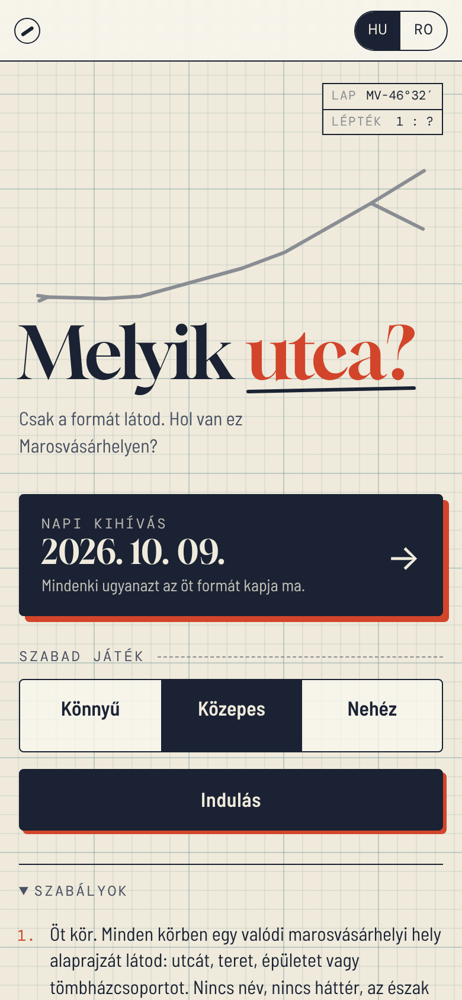
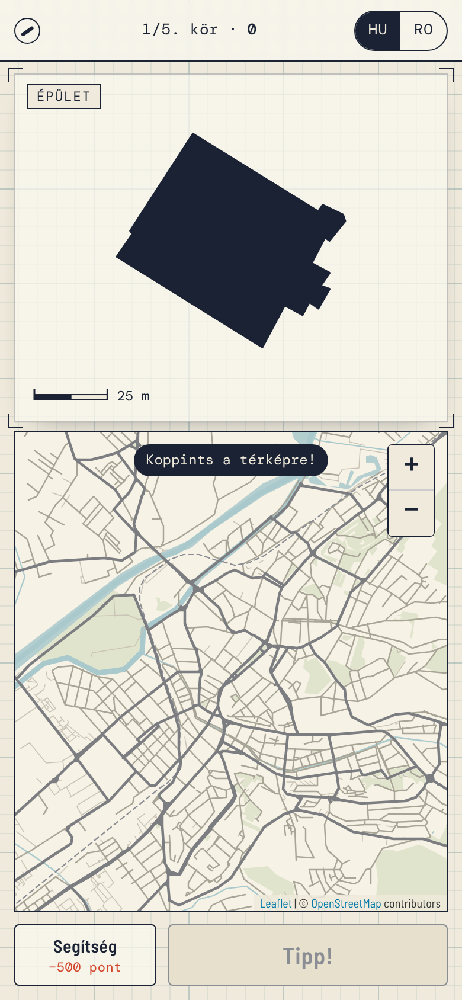
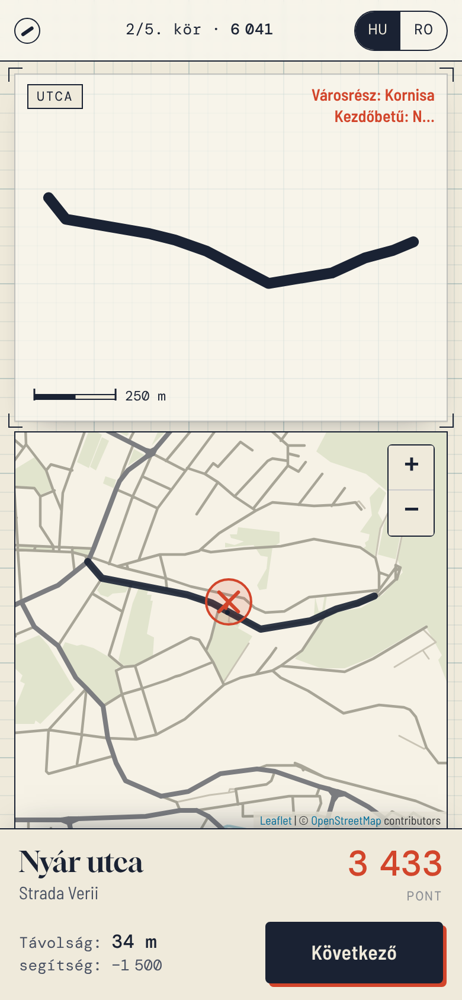
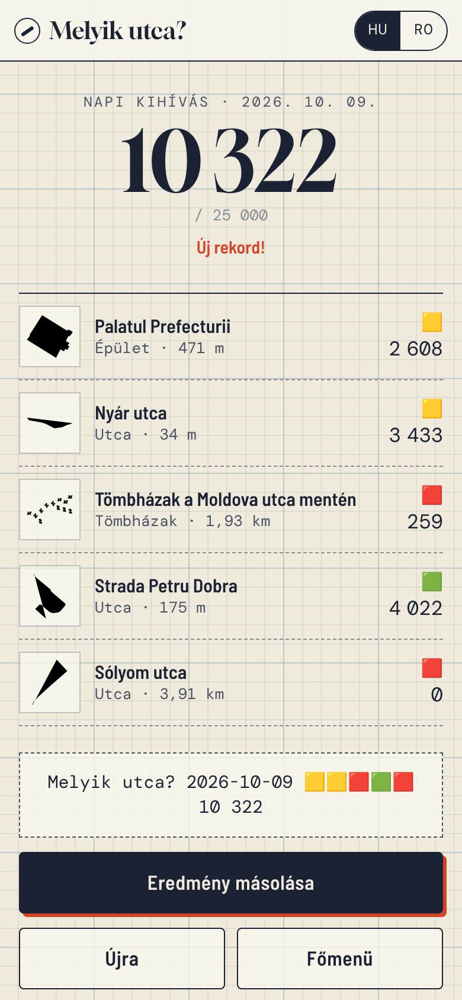

# melyikutca
Melyik utca? – Marosvásárhelyi utcakvíz: csak egy utca, tér vagy tömbházcsoport formáját látod, neked kell eltalálnod a térképen, hol van. Öt kör, távolság alapú pontozás, napi kihívás. Mobilra készült, az adatok az OpenStreetMapből származnak.

<p>




</p>

## Running it

It's a static site, so no build step is needed to play:

```sh
python3 -m http.server 8000   # then open http://localhost:8000
```

It works the same on GitHub Pages. Serve it from the repository root.

## Files

| | |
|---|---|
| `index.html`, `style.css`, `game.js` | the game (no framework, no CDN) |
| `config.js` | optional CARTO API key (see below) |
| `data/puzzles.json` | puzzles, generated by `build_puzzles.py` |
| `data/basemap.json` | label-free background map, generated by `build_puzzles.py` |
| `vendor/leaflet/` | Leaflet 1.9.4 (BSD-2-Clause) |
| `vendor/fonts/` | Gloock, Barlow Semi Condensed and DM Mono (SIL OFL 1.1) |

## Rebuilding the data

```sh
python3 build_puzzles.py            # uses .cache/ when present
python3 build_puzzles.py --refresh  # downloads everything again
```

The script uses only the standard library. It queries Overpass (overpass-api.de, then overpass.kumi.systems, then overpass.private.coffee, with retries) for the bounding box 46.49,24.47 – 46.60,24.66. It keeps only puzzles that lie inside the Târgu Mureș municipal boundary. It then writes both data files and prints a summary.

- **Streets** (`street`): named highways from primary to residential, plus pedestrian streets. Ways that share a name are merged when they touch. A street is skipped if it is shorter than 150 m, or if it is nearly straight: every vertex lies within max(25 m, 6 % of its length) of the main axis.
- **Squares** (`square`): `place=square`, named pedestrian areas, and highways named „Piața …” / „… tér”.
- **Landmarks** (`landmark`): named churches, theatres, schools, hospitals, hotels, the stadium and the like. Plain boxes are dropped unless the building is well known. The citadel walls are assembled from the unnamed `barrier=city_wall` ways.
- **Block clusters** (`blocks`): `building=apartments` within 80 m of each other, at least 4 blocks per cluster. Big estates are split into clusters of at most 18 blocks. Each cluster is labelled by the nearest named street.

Difficulty is a score from 0 to 100, built from fame (road class or landmark status, 45 %), distance from Rózsák tere (30 %) and size (25 %). It is then cut into easy below 42, medium below 66, and hard.

## Map tiles: CARTO now needs a key

Since 25 September 2026, CARTO serves its raster basemaps (`light_nolabels` included) only with an API key. Without one, every tile shows "API KEY REQUIRED". A key is free for non-commercial use, and you don't need an account: <https://carto.com/basemaps/apikey>. Put it in `config.js`:

```js
window.MELYIKUTCA_CONFIG = { cartoKey: 'your-key' };
```

If the key is empty, the game draws its own label-free map from OpenStreetMap data (`data/basemap.json`: roads, rail, the Mureș and other water, parks). It looks like pencil on tracing paper, which suits the game.

## Scoring

P = 5000 if d ≤ 25 m, otherwise P = 5000 · (e^(−(d−25)/700) − e^(−4.25)) / (1 − e^(−4.25)), which reaches 0 at 3 km. *d* is the distance from the pin to the nearest point of the shape: the line for a street, the outline for a building (0 if the pin is inside it). A guess about 500 m off scores about 2,500. Hints cost 500 points (neighbourhood) and then another 1,000 (first letter).

The daily challenge is seeded from the date in Europe/Bucharest time, so everyone gets the same five puzzles. They run from easy to hard, and puzzles served in the previous two weeks are avoided where possible.

Map data © [OpenStreetMap contributors](https://www.openstreetmap.org/copyright), ODbL.
